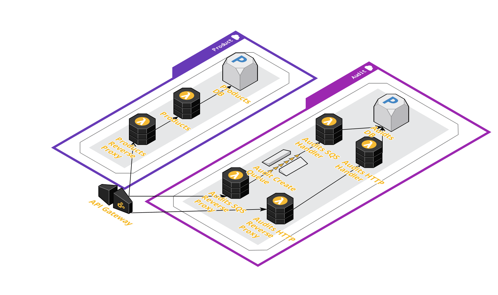

# OctoPub

OctoPub is an online library. It is hosted at [octopus.pub](https://octopus.pub/).

OctoPub has been designed to explore advanced deployment patterns in modern platforms like Lambda and Kubernetes, 
specifically:

* How do you perform blue/green and canary deployments to serverless platforms?
* How do you test feature branches, either locally or deployed to a hosted platform?
* How do you version deployments and APIs?
* How do you orchestrate database migrations?
* How do you safely perform testing in production?

While OctoPub has been has been written as a collection of microservices, it is not a goal of this project to explore 
design patterns like asynchronous communication, sagas, tracing, security, logging etc. Projects like 
[Online Boutique](https://github.com/GoogleCloudPlatform/microservices-demo/)
or [eShopOnContainers](https://github.com/dotnet-architecture/eShopOnContainers) provide better exaples of these 
patterns.

## Architecture



## Features

### In Memory Databases
By default, all services run with an in memory database, which removes the need to deploy specialized external 
databases for simple tests.

### Database Migrations
Where possible, databases are configured automatically with migration tools like [Liquidbase](https://www.liquibase.org/) 
or the [Entity Framework Migrations ](https://docs.microsoft.com/en-us/ef/core/managing-schemas/migrations/?tabs=dotnet-core-cli).

### Logging
All predictable errors have a unique error code assigned to them (see the **Errors** section below). This reaqdme will 
serve as a living document linking errors to issues and workarounds.

### JSONAPI
The [JSONAPI](https://jsonapi.org/) specification has been implemented for the public microservice APIs.

### Health Checking
Health checks present an interesting challenge with microservices. When each URL can potentially be backed by an 
individual microservice, how do you check the health of the system?

Traditional approaches like [Spring Actuator](https://docs.spring.io/spring-boot/docs/current/reference/html/actuator.html) 
provide a single health endpoint that is assumed to represent the health of the other endpoints served by the web 
application. This one-to-many approach for reporting health doesn't scale to Functions-as-a-Service (FaaS) though, as 
there is no guarantee that multiple endpoints will be served by one single application.

To support health checks on FaaS platforms, OctoPub exposes a `/health` endpoint which mirrors the `/api` endpoint. 
Each path under `/api` has a matching path in under `/health`, and the HTTP method used to access the API is then 
appended to the health endpoint.

So, to check the health of the service responding to GET requests to `/api/products`, you would perform a GET request 
to `/health/products/GET`. And to check the health of the service responding to POST requests to `/api/products`. you 
would perform a GET request to `/health/products/POST`.

Behind the scenes it makes sense for the same service that responds to GET requests to `/api/products` to also respond 
to GET requests to `/health/products/GET`. Having the a service report its own health removes many potential incorrect 
health reports, so this is the approach OctoPub has taken.

## Docker Compose

To run the application locally, execute the following command:

```bash
curl -fsS https://raw.githubusercontent.com/OctopusSamples/OctoPub/master/docker/docker-compose.yml | docker-compose -f - up -d
```

Then open [http://localhost:7080](http://localhost:7080).

## Error Codes
### AuditsService-Lambda-GeneralFailure
A catch all error for any exceptions thrown while processing a Lambda request.

The error `Table 'audits.audits' doesn't exist` can be fixed by rerunning the database migration Lambda.

### AuditsService-Lambda-DIFailure
This is likely reported when the dependency injection configuration was incorrect.

### AuditsService-Migration-GeneralFailure
A catch all error for any exceptions thrown while processing peforming a datbase migration.

### AuditsService-Migration-DIFailure
This is likely reported when the dependency injection configuration was incorrect.

### AuditsService-SQS-GeneralFailure
A catch all error for any exceptions thrown while processing a SQS request.

### AuditsService-Handler-CreateFailure
A catch all error when creating an entity.

### AuditsService-LocalSQS-GeneralFailure
A catch all error when processing SQS messages from a locally hosted feature branch.
