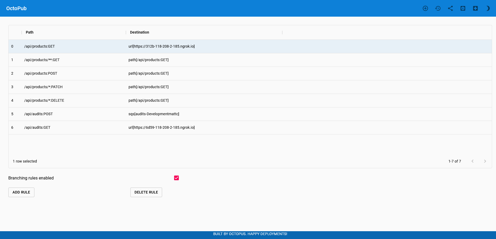

# Products Microservice
This service exposes an interface for retrieving, creating, editing, and deleting books from OctoPub, 
the online Octopus library. It is written with the [Quarkus](https://quarkus.io/) framework.

# Building

The `github/action.yml` file contains a GitHub Actions workflow used to build this service. The 
builds can be viewed on [GitHub](https://github.com/OctopusSamples/OctoPub/actions/workflows/products-service.yaml).

# Local debugging

Run a local copy of the service backed by an in-memory database with the command. The `MIGRATE_AT_START` 
environment variable instructs the application to run database migrations
when at startup, which is required when running locally as the in-memory database will be
empty by default:

```bash
MIGRATE_AT_START=true ./mvnw compile quarkus:dev
```

The following `curl` command can be used to list the products. This service exposes a JSONAPI
interface, which requires the `Accept` header be defined for each request:

```bash
curl 'http://localhost:8083/api/products' -H 'Accept: application/vnd.api+json'
```

# Feature branch testing

OctoPub has been designed to allow testing of feature branches without deploying the complete
microservice stack. Feature branches can either be deployed to platforms like AWS Lambda, or run
locally.

To test this microservice locally, start the service from the command line or from within
your IDE. This exposes the API at http://localhost:8083.

To expose the service publicly, even when your local PC is behind a NAT Gateway with no public
IP address, install [Ngrok](https://ngrok.com/), and run the command:

```bash
ngrok http 8083
```

The output will look something like this:

```bash
ngrok by @inconshreveable
Session Status                online
Session Expires               1 hour, 59 minutes
Version                       2.3.40
Region                        United States (us)
Web Interface                 http://127.0.0.1:4040
Forwarding                    http://312b-118-208-2-185.ngrok.io -> http://localhost:8083
Forwarding                    https://312b-118-208-2-185.ngrok.io -> http://localhost:8083
Connections                   ttl     opn     rt1     rt5     p50     p90
                              0       0       0.00    0.00    0.00    0.00
```

Your local development instance is now accessible from the public address https://312b-118-208-2-185.ngrok.io
(note this URL changes every time).

In the [branching rules section of the OctoPub frontend](https://development.octopus.pub/#/branching)
define a rule with a `Path` of `/api/products:GET` and a `Destination` of `url[https://312b-118-208-2-185.ngrok.io]`.
This rule redirects `GET` requests to any path matching `/api/products` to the supplied URL instead of
the default Lambda:


Open the [main OctoPub page](https://development.octopus.pub/#/index.html), and you will notice
your local microservice responding to requests.

To direct all requests to your local microservice, add the following rules:

| PATH                     | Destination                                |
| ------------------------ | ------------------------------------------ |
| `/api/products:GET`      | `url[https://312b-118-208-2-185.ngrok.io]` |
| `/api/products/**:GET`   | `path[/api/products:GET]` |
| `/api/products:POST`     | `path[/api/products:GET]` |
| `/api/products/*:PATCH`  | `path[/api/products:GET]` |
| `/api/products/*:DELETE` | `path[/api/products:GET]` |

Rules with the `path[...]` syntax are used to lookup another rule. This provides the opportunity
to define the redirection rule once, and then reuse it for multiple paths:

